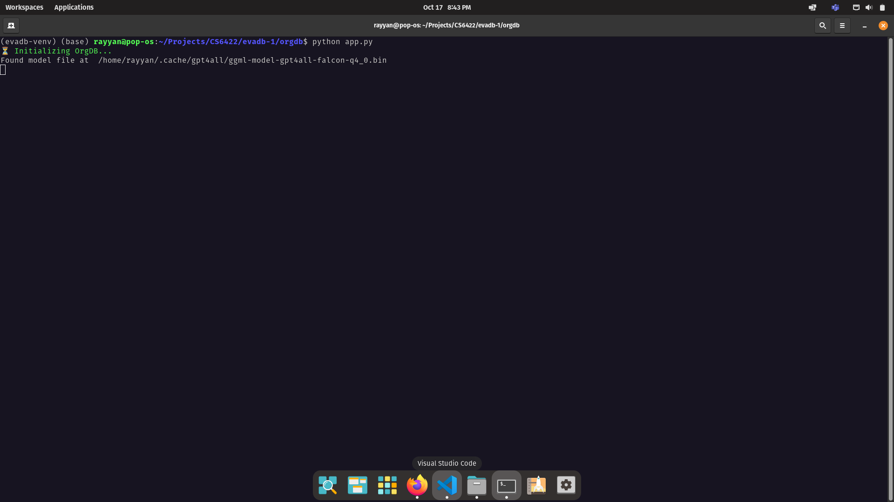
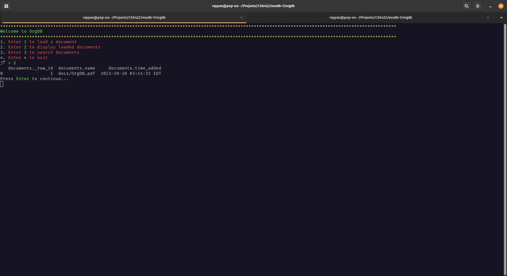
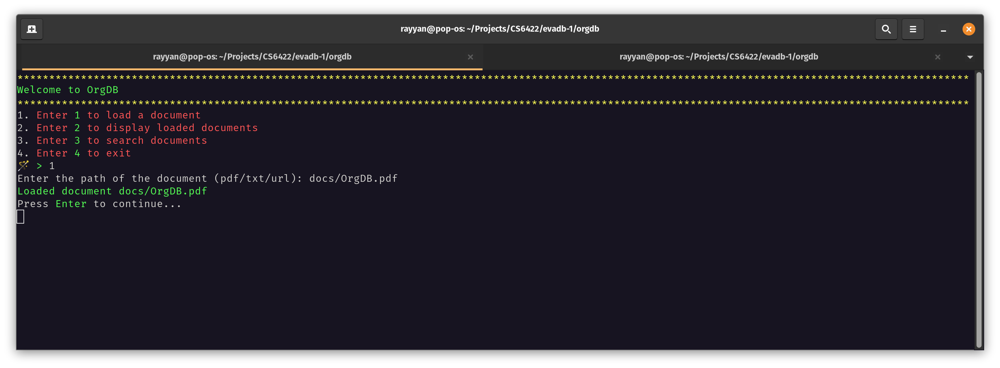
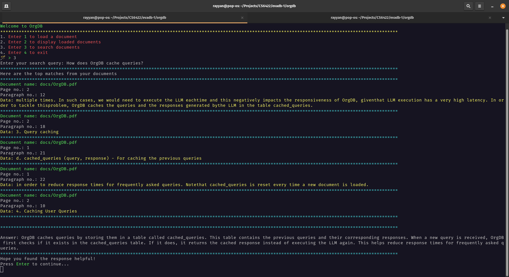
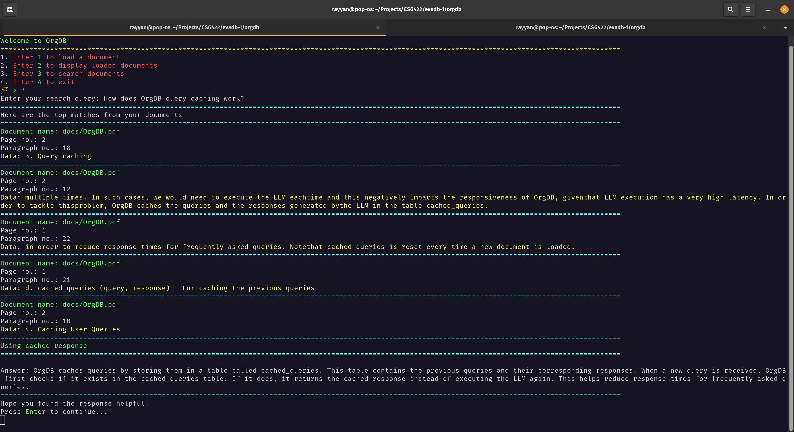

# OrgDB
## Running
1. `pip install -r requirements.txt`
2. `python app.py` 

## Introduction
OrgDB is a tool that is closely inspired from Gerev and developed using EvaDB. OrgDB allows users to load their documents and supports user queries by generating relevant answers within the context of the loaded documents. In the following sections, I will describe the key features of OrgDB, some important implementation details, few use cases of OrgDB and finally the future directions.

## Features

1. Supports loading of documents of the following types: pdf, txt, web pages
2. Allows users to display loaded documents along with the timestamp when they are loaded.
3. Allows users to search documents using some query string. Display the most relevant results from the documents along with the sources and also generates a consolidated response for the user.
4. Supports caching of user queries that helps reduce response times in case of semantically similar queries.

## Implementation Details
### Following tables are being maintained using EvaDB
1. mydocs (name, page, paragraph, data) -  For storing the parsed and decomposed txt and web pages
2. pdfdocs (name, page, paragraph, data) - For storing the loaded PDF documents
3. documents (name, time_added) - For keeping track of the loaded documents and the timestamp when they are loaded
4. cached_queries (query, response) - For caching the previous queries in order to reduce response times for frequently asked queries. Note that cached_queries is reset every time a new document is loaded.

### Finding relevant documents
A custom function SentenceFeatureExtractor (uses all-MiniLM-L6-v2 from sentence_transformers) has been used (defined in sentence_feature_extractor.py) for converting document paragraphs into feature vectors.
The paragraphs that have the highest similarity (i.e lowest similarity distance) with the query string using the feature embeddings generated from SentenceFeatureExtractor are returned in the result.

### Generating Consolidated Response
The data of the paragraphs having highest similarity scores (lowest similarity distances) , as returned in the previous step, is concatenated and used as the context.
The LLM GPT4All("ggml-model-gpt4all-falcon-q4_0.bin") is being used to generate the response to the query based on the generated context.

### Caching User Queries
It may be possible that a user asks semantically similar queries multiple times. In such cases, we would need to execute the LLM each time and this negatively impacts the responsiveness of OrgDB, given that LLM execution has a very high latency. In order to tackle this problem, OrgDB caches the queries and the responses generated by the LLM in the table cached_queries.

When a new query arrives, we first check the semantic similarity of the query with the cached queries using the feature embeddings generated by SentenceFeatureExtractor. If the new query is very similar to some older cached query, we simply return the cached response rather than executing the LLM again.

## Use Cases
1. Loading and querying documents

2. Query caching
How does OrgDB cache queries, How does OrgDB query caching work (semantically similar)

## Future Directions
1. Improving the performance of txt and web page queries.
2. Use more powerful LLMs like ChatGpt or GPT4 for generating consolidated responses.
3. Currently the user needs to explicitly provide the documents that they want OrgDB to load in its database. As an extension, OrgDB can be integrated with platforms like Piazza or Slack, where it will have access to all the posts and messages on a channel. This will make the experience more seamless.
4. Currently the UI is terminal based. As an extension, a GUI can be developed for OrgDB.
